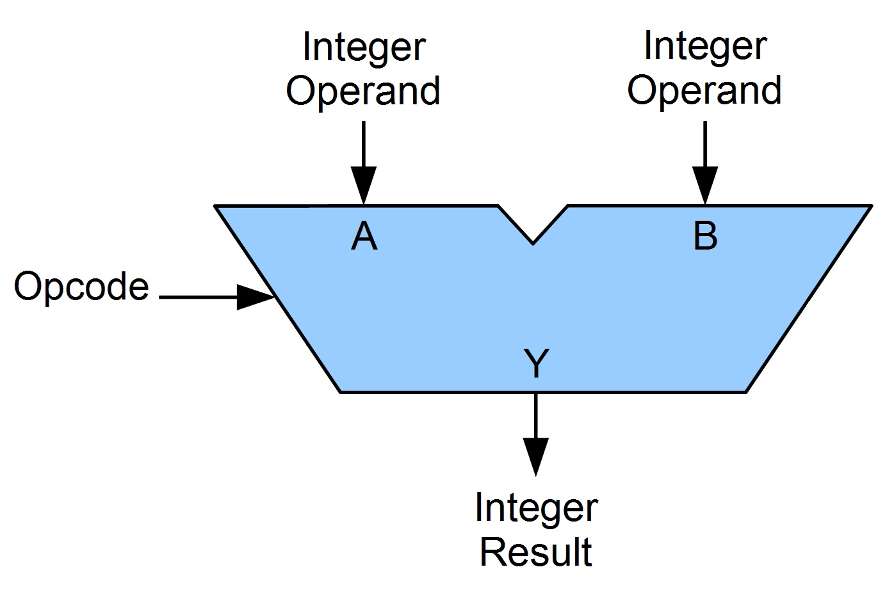

# Arithmetic Logic Unit (ALU)

**What is ALU?**
\
\
**Arithmetic Logic Unit (ALU)** is an integrated circuit in a CPU or GPU, which performs arithmetic and logic operations. The arithmetic instructions include addition, subtraction, multiplication, division, and shifting operations, while logic operations include AND, OR, XOR, and NOT operations.
\
\
**Operands:**
\
The inputs of an ALU are the data to be operated on, called operands, and a code indicating the operation to be performed; the ALU's output is the result of the performed operation.
\
\
**Opcode:**
\
The opcode input is a parallel bus that conveys to the ALU an operation selection code, which is an enumerated value that specifies the desired arithmetic or logic operation to be performed by the ALU. 

The code provided is for a **4-bit arithmetic logic unit**.
The design includes:

Two inputs **"a"** and **"b"** [each 4 bits]

One **"op"** to set the operation to perform [2 bits]

One output as **"result"** [8 bits]
\
\
**Operations** implented are:

op: 00 -- **Addition**

op: 01 -- **Multiplication** 

op: 10 -- **Modulo**

op: 11 -- **Bitwise AND**

Testbench (ALU_TB) has been provided to verify the design. 

